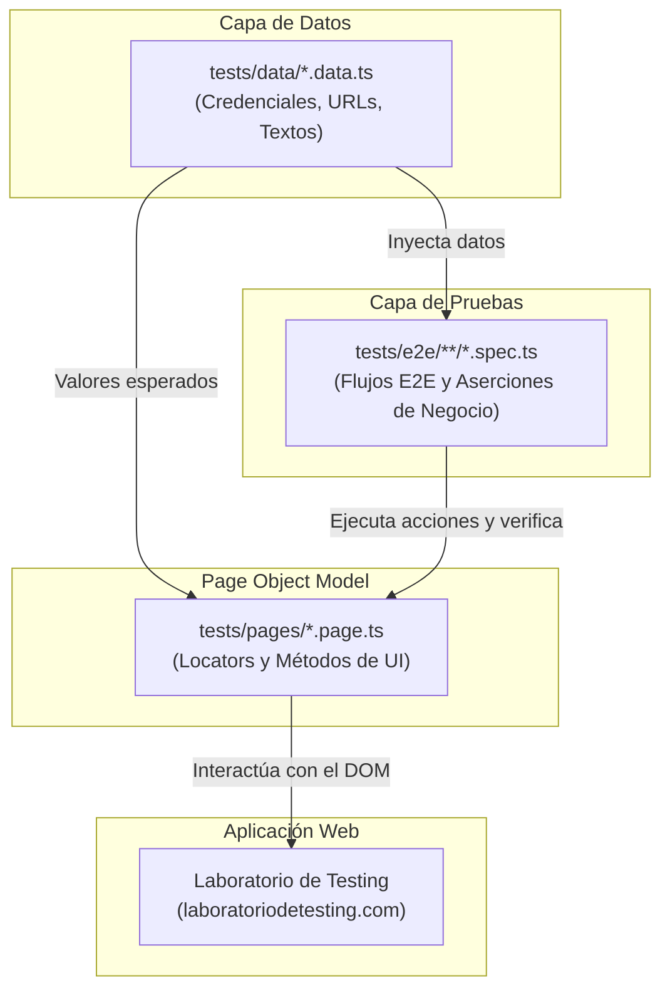

# 🎭 PlaywrightIA

<p align="center">
  <strong>Framework de Pruebas End-to-End (E2E) con Playwright, TypeScript y Arquitectura Asistida por Inteligencia Artificial</strong>
</p>

<p align="center">
  
  
  
  
  
</p>

---

## 📋 Tabla de Contenidos

1. [Visión General](#-visión-general)
2. [Características Principales](#-características-principales)
3. [Arquitectura del Framework](#-arquitectura-del-framework)
4. [Estructura del Proyecto](#-estructura-del-proyecto)
5. [Ecosistema de Agentes de IA](#-ecosistema-de-agentes-de-ia)
6. [Requisitos Previos](#-requisitos-previos)
7. [Instalación y Configuración](#-instalación-y-configuración)
8. [Ejecución de Pruebas](#-ejecución-de-pruebas)
9. [Reportes, Trazas y Depuración](#-reportes-trazas-y-depuración)
10. [Integración Continua (CI/CD)](#-integración-continua-cicd)
11. [Buenas Prácticas y Convenciones](#-buenas-prácticas-y-convenciones)
12. [Documentación Complementaria](#-documentación-complementaria)

---

## 🎯 Visión General

**PlaywrightIA** es una solución integral de automatización de pruebas End-to-End (E2E) diseñada para validar flujos críticos sobre la plataforma de comercio electrónico de pruebas [Laboratorio de Testing](https://www.laboratoriodetesting.com/).

El objetivo del proyecto es establecer un estándar moderno de calidad de software combinando:
- **Patrón Page Object Model (POM)** estricto para máxima mantenibilidad y reutilización.
- **TypeScript** con tipado fuerte en modelos, páginas y datos de prueba.
- **Flujo Multi-Agente de Inteligencia Artificial** (GitHub Copilot y Google Antigravity) para planificar, generar y autoreparar suites de prueba de manera continua.

---

## 🚀 Características Principales

- **Page Object Model (POM) Estricto**: Separación clara entre la representación de la interfaz de usuario y la lógica de los escenarios de prueba.
- **Datos de Prueba Externos e Inmutables**: Centralización de credenciales, selectores, URLs y mensajes en `tests/data/` tipados con `as const`.
- **Selectores Semánticos y Resilientes**: Prioridad absoluta a selectores accesibles (`getByRole`, `getByLabel`, `getByPlaceholder`, `getByText`) y `data-testid`, evitando selectores CSS frágiles o rutas XPath absolutas.
- **Web-First Assertions**: Uso exclusivo de aserciones automáticas reintentables (`toBeVisible`, `toHaveURL`, `toHaveText`, `toBeEnabled`).
- **Cero Esperas Arbitrarias**: Prohibición explícita de `waitForTimeout()` y sincronización basada en eventos/estados de UI reales.
- **Asistencia con Agentes de IA**:
  - `playwright-test-planner`: Diseño de planes y matrices de prueba.
  - `playwright-test-generator`: Codificación estructurada de tests y Page Objects.
  - `playwright-test-healer`: Diagnóstico autónomo y auto-reparación de tests inestables o rotos (*flaky tests*).
- **Diagnóstico y Observabilidad**: Grabación automática de trazas (`Trace Viewer`), videos en ejecuciones y capturas de pantalla de evidencia.
- **CI/CD Integrado**: Flujo de GitHub Actions listo para ejecución en ramas principales y Pull Requests con publicación de reportes.

---

## 🏗️ Arquitectura del Framework

El framework desacopla completamente las capas de datos, interacción de UI y lógica de validación:



---

## 📂 Estructura del Proyecto

```text
PlaywrightIA/
├── .agents/                        # Configuración para Google Antigravity
│   ├── rules/
│   │   └── behavior.md             # Reglas de comportamiento autónomo del asistente
│   └── skills/
│       └── playwright-pom/         # Skill con estándares de arquitectura POM
│           └── SKILL.md
├── .github/
│   ├── agents/                     # Agentes especializados para GitHub Copilot
│   │   ├── playwright-test-generator.agent.md
│   │   ├── playwright-test-healer.agent.md
│   │   └── playwright-test-planner.agent.md
│   └── workflows/
│       ├── copilot-setup-steps.yml # Pasos de preparación de entorno
│       └── playwright.yml          # Pipeline de integración continua (CI)
├── docs/                           # Documentación técnica y funcional
│   ├── screenshots/                # Evidencias visuales de pruebas ejecutadas
│   ├── analysis_results.md         # Inventario y análisis de elementos interactivos
│   ├── GUIA_AGENTES_Y_ARQUITECTURA.md # Guía detallada de coexistencia Copilot/Antigravity
│   ├── historia-carrito.md         # Especificación funcional del carrito de compras
│   ├── historia-login.md           # Especificación funcional de autenticación
│   ├── reporte-carrito.md          # Reporte de ejecución del flujo de checkout
│   └── README.md                   # Índice del centro de documentación
├── specs/                          # Planes de prueba formales generados por IA
│   ├── login-test-plan.md
│   └── login.md
├── tests/                          # Código fuente de las pruebas automatizadas
│   ├── data/                       # Datos de prueba externos centralizados
│   │   ├── cart.data.ts
│   │   └── login.data.ts
│   ├── e2e/                        # Especificaciones de prueba organizadas por módulo
│   │   ├── cart/
│   │   │   ├── carrito.spec.ts
│   │   │   └── cart-checkout.spec.ts
│   │   └── login/
│   │       └── login.spec.ts
│   ├── pages/                      # Page Objects (abstracción de la UI)
│   │   ├── cart.page.ts
│   │   ├── checkout.page.ts
│   │   ├── login.page.ts
│   │   └── product.page.ts
│   └── seed.spec.ts                # Prueba base para verificación rápida de conectividad
├── GEMINI.md                       # Directivas y autonomía de agente para Antigravity
├── package.json                    # Scripts del proyecto y dependencias
├── playwright.config.ts            # Configuración principal de Playwright
├── tsconfig.json                   # Configuración del compilador TypeScript
└── README.md                       # Documentación principal del repositorio
```

---

## 🤖 Ecosistema de Agentes de IA

El repositorio cuenta con una integración pionera de agentes de IA para asistir a los ingenieros de QA en cada etapa del desarrollo:

| Agente | Ubicación | Rol y Responsabilidad |
| :--- | :--- | :--- |
| **`playwright-test-planner`** | `.github/agents/` | Explora la aplicación web de forma autónoma mediante MCP y genera planes de prueba estructurados en Markdown con casos positivos, negativos y de borde. |
| **`playwright-test-generator`** | `.github/agents/` | Convierte planes de prueba en código TypeScript ejecutable respetando estrictamente el patrón Page Object Model y la separación de datos. |
| **`playwright-test-healer`** | `.github/agents/` | Ejecuta pruebas fallidas, analiza el DOM, trazas y capturas, y corrige selectores o aserciones de forma autónoma hasta verificar la prueba en verde. |
| **Google Antigravity Agent** | `.agents/` / `GEMINI.md` | Asistente de ciclo completo para refactorizaciones estructurales, auditorías de calidad de código, ejecución y diagnóstico en caliente. |

> 💡 Para más detalles sobre cómo interactuar y sacar el máximo provecho de estos agentes, consulta la [Guía de Agentes y Arquitectura](docs/GUIA_AGENTES_Y_ARQUITECTURA.md).

---

## ⚙️ Requisitos Previos

Asegúrate de contar con las siguientes herramientas en tu entorno de trabajo:

- **Node.js**: Versión 18.x o superior (se recomienda versión LTS activa, ej. 20.x / 22.x).
- **npm**: Versión 9.x o superior (incluido con Node.js).
- **Git**: Para control de versiones.

---

## 📥 Instalación y Configuración

1. **Clonar el repositorio**:
   ```bash
   git clone https://github.com/tu-usuario/PlaywrightIA.git
   cd PlaywrightIA
   ```

2. **Instalar dependencias de Node.js**:
   ```bash
   npm install
   ```

3. **Instalar navegadores de Playwright**:
   Descarga los navegadores necesarios (Chromium, Firefox, WebKit) junto con sus dependencias del sistema:
   ```bash
   npx playwright install --with-deps
   ```

---

## ▶️ Ejecución de Pruebas

El proyecto cuenta con scripts configurados en `package.json` para facilitar las tareas comunes:

### Comandos Rápidos con `npm`

| Comando | Descripción |
| :--- | :--- |
| `npm test` | Ejecuta toda la suite de pruebas en paralelo. |
| `npm run test:headed` | Ejecuta las pruebas con el navegador visible (modo headed). |
| `npm run test:ui` | Abre la interfaz gráfica interactiva de Playwright (Time-Travel Debugging). |
| `npm run test:login` | Ejecuta únicamente la suite de autenticación (`login.spec.ts`). |
| `npm run test:cart` | Ejecuta el flujo integral de carrito y checkout (`cart-checkout.spec.ts`). |
| `npm run test:debug` | Inicia el modo de depuración paso a paso (Playwright Inspector). |
| `npm run report` | Abre el reporte HTML interactivo de la última ejecución. |

### Comandos Avanzados de Playwright CLI

```bash
# Ejecutar un archivo específico
npx playwright test tests/e2e/login/login.spec.ts

# Ejecutar una prueba específica por nombre o patrón
npx playwright test -g "Login exitoso"

# Ejecutar sobre un navegador específico (ej. Chromium)
npx playwright test --project=chromium

# Ejecutar con salida detallada en consola
npx playwright test --reporter=list
```

---

## 📊 Reportes, Trazas y Depuración

### 1. Reporte HTML Interactivo
Tras cada ejecución de pruebas, Playwright genera un reporte visual en `playwright-report/`:
```bash
npm run report
```
El reporte incluye estado por escenario, duración, pasos ejecutados, logs y enlaces directos a las trazas y videos grabados.

### 2. Trace Viewer (Visor de Trazas)
Las trazas están configuradas con `trace: 'on'` en `playwright.config.ts`, permitiendo depurar visualmente cada acción, snapshot del DOM, llamadas de red y consola:
```bash
# Abrir una traza específica desde test-results
npx playwright show-trace test-results/<directorio-del-test>/trace.zip
```

### 3. Capturas de Pantalla de Evidencia
Las capturas generadas durante la ejecución de flujos críticos se almacenan organizadas en:
- `docs/screenshots/` (capturas de hitos de negocio: login exitoso, estados del carrito, orden confirmada).

---

## 🔄 Integración Continua (CI/CD)

El proyecto cuenta con integración continua automatizada mediante **GitHub Actions** en `.github/workflows/playwright.yml`.

### Flujo del Pipeline:
1. **Trigger**: Se ejecuta automáticamente en cada `push` o `pull_request` a las ramas `main` y `master`.
2. **Entorno**: Contenedor Ubuntu con Node.js LTS.
3. **Instalación**: `npm ci` y descarga de navegadores de Playwright con `npx playwright install --with-deps`.
4. **Ejecución**: `npx playwright test` ejecutando suites en paralelo.
5. **Publicación de Artefactos**: Sube el directorio `playwright-report/` como artefacto descargable disponible durante 30 días, incluso si alguna prueba falla (`if: ${{ !cancelled() }}`).

---

## 📏 Buenas Prácticas y Convenciones

Para mantener la robustez y escalabilidad del repositorio, todo desarrollo debe seguir estas reglas:

### 1. Page Object Model (POM)
- Cada página o componente relevante tiene su propia clase en `tests/pages/`.
- Los locators se definen como propiedades `readonly Locator`.
- Los métodos de la clase representan acciones de usuario o validaciones de estado de página reutilizables.
- Nunca incluir credenciales o datos fijos en las clases Page Object.

### 2. Gestión de Datos de Prueba
- Todos los datos de entrada (URLs, usuarios, mensajes, títulos) se colocan en `tests/data/*.data.ts`.
- Usar `as const` para asegurar inmutabilidad y autocompletado en TypeScript.

### 3. Locators y Aserciones
- **Prioridad de Selectores**:
  1. `page.getByRole(...)`
  2. `page.getByLabel(...)`
  3. `page.getByPlaceholder(...)`
  4. `page.getByText(...)`
  5. `page.locator('[data-testid="..."]')`
- **Prohibido**:
  - `page.waitForTimeout()` o `setTimeout` arbitrarios.
  - Selectores XPath frágiles o dependientes de clases CSS dinámicas.
  - Dependencias de orden entre pruebas; cada escenario debe ser atómico e independiente.

---

## 📚 Documentación Complementaria

Explora los recursos adicionales disponibles en el repositorio:

- 📖 [Guía de Agentes y Arquitectura](docs/GUIA_AGENTES_Y_ARQUITECTURA.md): Explicación exhaustiva de la convivencia entre GitHub Copilot y Google Antigravity.
- 🔍 [Análisis de Elementos Interactivos](docs/analysis_results.md): Inventario técnico de los componentes del Laboratorio de Testing.
- 📑 [Plan de Pruebas de Login](specs/login-test-plan.md): Matriz de casos de prueba para el módulo de autenticación.
- 🛒 [Reporte de Pruebas de Carrito y Checkout](docs/reporte-carrito.md): Documentación de validaciones y capturas del flujo de compra.
- 🎯 [Skill de POM para Antigravity](.agents/skills/playwright-pom/SKILL.md): Especificación formal de reglas para agentes autónomos.

---

<p align="center">
  Hecho con ❤️ para la comunidad de Testing y QA Automation
</p>
