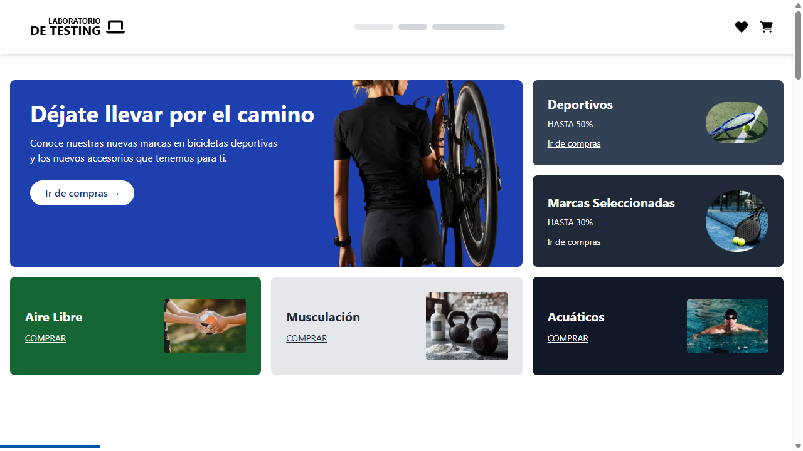
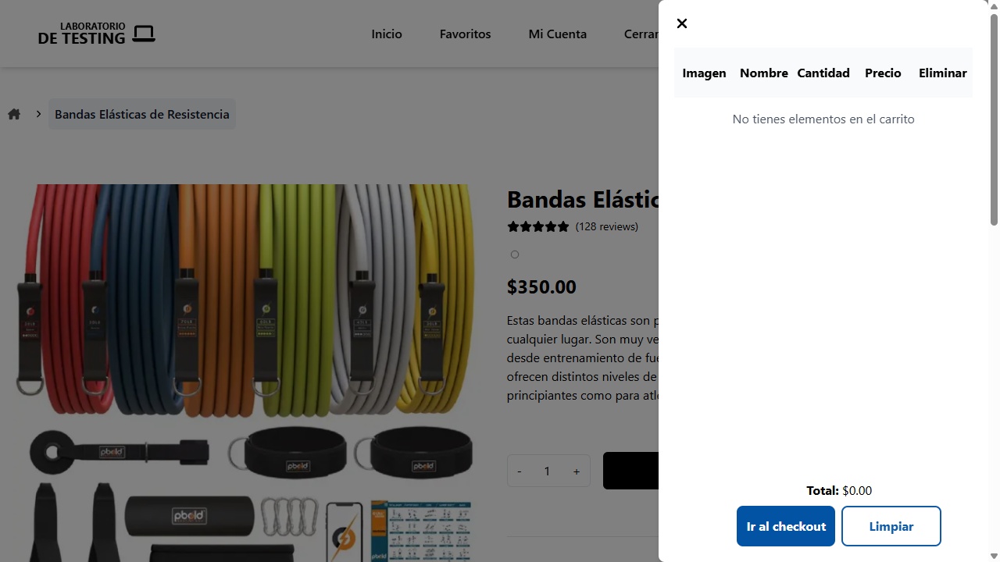
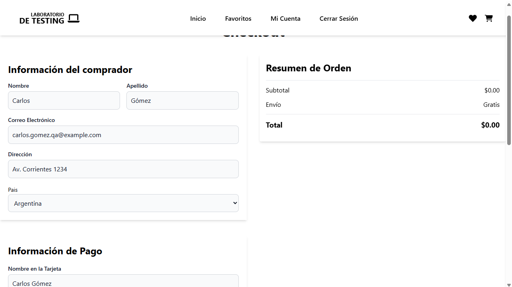
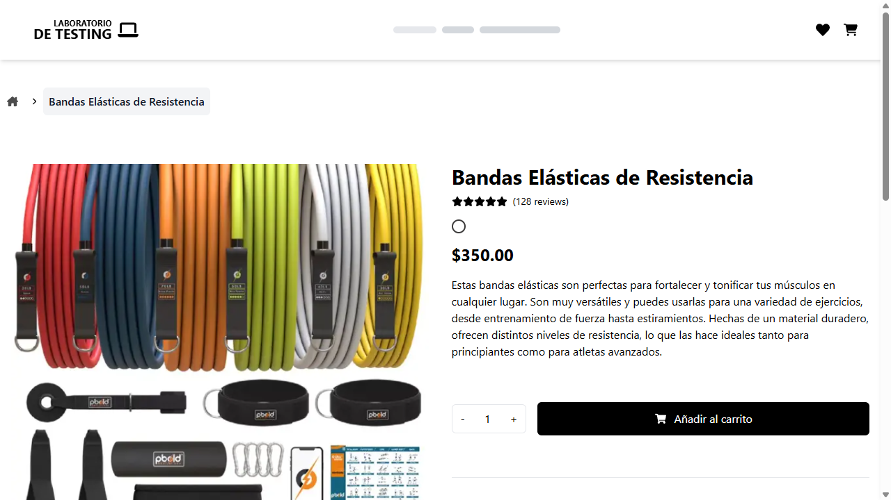
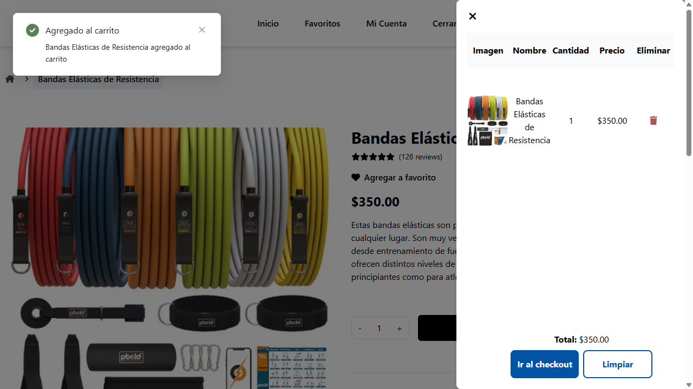
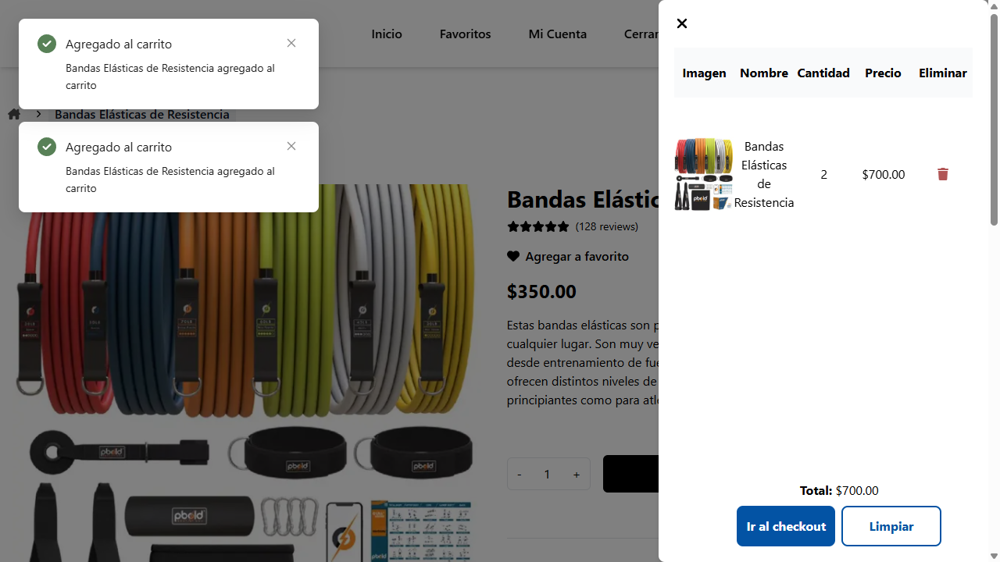
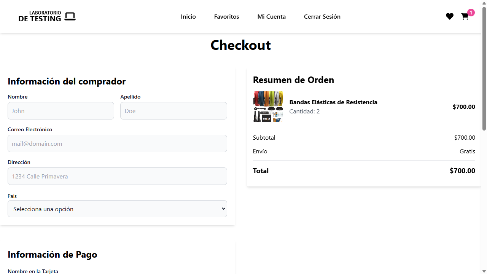
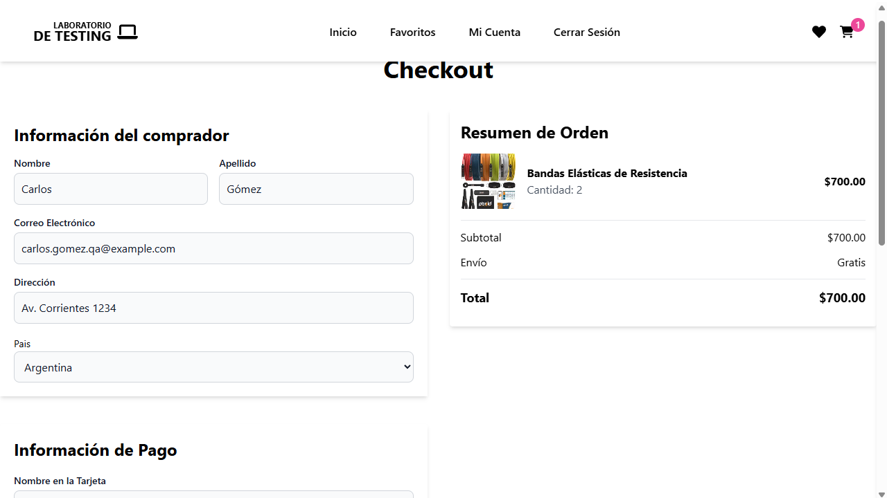
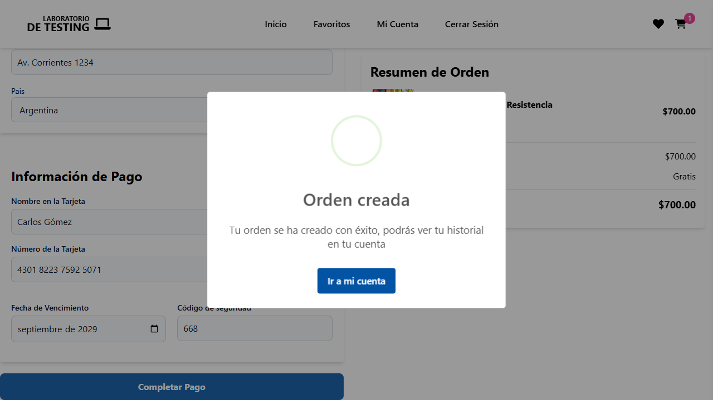

# Reporte de Ejecución: Flujo de Carrito y Checkout

**Proyecto:** Automatización E2E - Laboratorio de Testing  
**Historia de Usuario:** [docs/historia-carrito.md](file:///D:/DRIVE/15-WORKSPACE%20-%20ESTUDIO%20-%20DATOS/IdeaProjects/PlaywrightIA/docs/historia-carrito.md)  
**Herramienta de Ejecución:** Playwright CLI (`@playwright/test`)  
**Fecha de Ejecución:** 25 de septiembre de 2026  
**Resultado Global:** :white_check_mark: **PASÓ (100% Criterios Cumplidos)**

---

## 1. Resumen Ejecutivo

Se ejecutó de manera completa y autónoma el flujo de compras de extremo a extremo (E2E) para el producto **"Bandas Elásticas de Resistencia"**, cubriendo desde la autenticación del usuario registrado, la validación de restricciones en carrito vacío, la adición inicial de 1 unidad, la actualización a 2 unidades con recálculo dinámico del total, hasta el proceso de checkout con datos del comprador, tarjeta de crédito y la confirmación modal de creación de orden.

Toda la interacción y validaciones se implementaron siguiendo el estándar **Page Object Model (POM)** y ejecutadas exclusivamente mediante la **Playwright CLI**.

---

## 2. Datos de Prueba Utilizados

| Categoría | Campo | Valor Utilizado |
|---|---|---|
| **Autenticación** | Email | `arcadisweb@gmail.com` |
| **Autenticación** | Contraseña | `libreroloco` |
| **Producto** | Nombre | `Bandas Elásticas de Resistencia` |
| **Producto** | URL | `/products/bandas-elasticas-de-resistencia` |
| **Producto** | Precio Unitario | `$350.00` |
| **Producto** | Cantidad Inicial | `1 unidad` (Total: `$350.00`) |
| **Producto** | Cantidad Final | `2 unidades` (Total: `$700.00`) |
| **Comprador** | Nombre Completo | `Carlos Gómez` |
| **Comprador** | Correo Electrónico | `carlos.gomez.qa@example.com` |
| **Comprador** | Dirección / País | `Av. Corrientes 1234`, `Argentina` |
| **Pago** | Titular de Tarjeta | `Carlos Gómez` |
| **Pago** | Número de Tarjeta | `4301822375925071` (Visa) |
| **Pago** | Fecha Expiración | `09-2029` (`2029-09`) |
| **Pago** | Código CVV | `668` |

---

## 3. Matriz de Criterios de Aceptación

| # | Criterio de Aceptación (Historia de Usuario) | Estado | Evidencia |
|---|---|:---:|---|
| 1 | Usuario autenticado previamente antes de navegar al producto | :white_check_mark: PASÓ | [Paso 1](#paso-1-autenticación-de-usuario) |
| 2 | No se puede hacer checkout / completar pago con carrito vacío | :white_check_mark: PASÓ | [Paso 2](#paso-2-validación-de-carrito-vacío-y-bloqueo-de-pago) |
| 3 | Producto aparece en el carrito con nombre, precio ($350) y cantidad 1 | :white_check_mark: PASÓ | [Paso 4](#paso-4-adición-del-producto-al-carrito-1-unidad) |
| 4 | El total del carrito se actualiza correctamente (2 unidades = $700) | :white_check_mark: PASÓ | [Paso 5](#paso-5-actualización-de-cantidad-a-2-unidades-y-total-700) |
| 5 | El checkout muestra el resumen del pedido | :white_check_mark: PASÓ | [Paso 6](#paso-6-navegación-al-checkout-y-resumen-de-orden) |
| 6 | Se ingresa información de datos personales al azar | :white_check_mark: PASÓ | [Paso 7](#paso-7-ingreso-de-datos-personales-y-tarjeta-de-crédito) |
| 7 | Se ingresa información de tarjeta de crédito y se hace el pago | :white_check_mark: PASÓ | [Paso 7](#paso-7-ingreso-de-datos-personales-y-tarjeta-de-crédito) |
| 8 | Se verifica que la orden ha sido creada (Modal de confirmación) | :white_check_mark: PASÓ | [Paso 8](#paso-8-confirmación-de-orden-creada) |

---

## 4. Detalle Paso a Paso con Evidencias

### Paso 1: Autenticación de Usuario
- **Acción:** Navegación a `/auth/login`, ingreso de credenciales válidas (`arcadisweb@gmail.com` / `libreroloco`) y envío del formulario.
- **Validación:** Redirección exitosa a la página de inicio (`/`) con sesión activa.
- **Captura:**
  

---

### Paso 2: Validación de Carrito Vacío y Bloqueo de Pago
- **Acción:** Se abre el cajón lateral del carrito (`aside`), se vacía cualquier elemento previo mediante el botón "Limpiar" (`[data-at="empty-cart"]`) y se accede a `/checkout`.
- **Validación:** Se verifica el mensaje `"No tienes elementos en el carrito"` con total `$0.00`. Al ingresar los datos en el checkout con carrito vacío, el botón **"Completar Pago"** permanece deshabilitado (`disabled`), impidiendo la finalización de órdenes vacías.
- **Capturas:**
  - *Estado del cajón lateral vacío:*
    
  - *Bloqueo de pago en checkout vacío:*
    

---

### Paso 3: Navegación al Producto
- **Acción:** Navegación a `/products/bandas-elasticas-de-resistencia`.
- **Validación:** Título `Bandas Elásticas de Resistencia` visible, precio `$350.00` y contador de cantidad inicial en `1`.
- **Captura:**
  

---

### Paso 4: Adición del Producto al Carrito (1 Unidad)
- **Acción:** Clic en botón `Añadir al carrito` (`[data-at="add-to-cart"]`) y apertura del cajón lateral (`[data-at="cart-opener"]`).
- **Validación:** El producto figura en la cuadrícula del carrito con:
  - Nombre: `Bandas Elásticas de Resistencia`
  - Cantidad: `1`
  - Precio: `$350.00`
  - Total: `$350.00`
- **Captura:**
  

---

### Paso 5: Actualización de Cantidad a 2 Unidades y Total $700
- **Acción:** Se añade una segunda unidad del producto y se reabre el carrito.
- **Validación:** El carrito actualiza la cantidad a `2` unidades y el total asciende a `$700.00`.
- **Captura:**
  

---

### Paso 6: Navegación al Checkout y Resumen de Orden
- **Acción:** Clic en `"Ir al checkout"` desde el carrito lateral.
- **Validación:** La página `/checkout` carga correctamente y la sección **"Resumen de Orden"** muestra:
  - Producto: `Bandas Elásticas de Resistencia`
  - Cantidad: `Cantidad: 2`
  - Subtotal: `$700.00`
  - Envío: `Gratis`
  - Total: `$700.00`
- **Captura:**
  

---

### Paso 7: Ingreso de Datos Personales y Tarjeta de Crédito
- **Acción:** Diligenciamiento de:
  - Nombre: `Carlos`, Apellido: `Gómez`, Email: `carlos.gomez.qa@example.com`, Dirección: `Av. Corrientes 1234`, País: `Argentina`.
  - Nombre en tarjeta: `Carlos Gómez`, Tarjeta: `4301822375925071`, Expiración: `09-2029`, CVV: `668`.
- **Validación:** Detección de tarjeta Visa, validación en tiempo real y habilitación del botón **"Completar Pago"**.
- **Captura:**
  

---

### Paso 8: Confirmación de Orden Creada
- **Acción:** Clic en el botón **"Completar Pago"**.
- **Validación:** Se despliega el diálogo modal de confirmación con:
  - Encabezado H2: `"Orden creada"`
  - Mensaje: `"Tu orden se ha creado con éxito, podrás ver tu historial en tu cuenta"`
  - Botón de navegación: `"Ir a mi cuenta"`
- **Captura:**
  

---

## 5. Arquitectura Técnica Implementada (POM)

Siguiendo las directrices del proyecto y el skill `playwright-pom`, se crearon y modularon los siguientes componentes:

```text
tests/
├── data/
│   ├── login.data.ts           # Credenciales y URLs de login
│   └── cart.data.ts            # Datos de producto, comprador, tarjeta y rutas de screenshots
├── pages/
│   ├── login.page.ts           # POM de Login
│   ├── product.page.ts         # POM de Producto (detalle, cantidad, añadir al carrito)
│   ├── cart.page.ts            # POM de Carrito (cajón lateral, vaciado, validación de totales)
│   └── checkout.page.ts        # POM de Checkout (formulario comprador, tarjeta, modal de orden)
└── e2e/
    └── cart/
        └── cart-checkout.spec.ts  # Test E2E principal con reporte de screenshots paso a paso
```

---

## 6. Comando de Reproducción vía Playwright CLI

Para reproducir este flujo de forma idéntica mediante Playwright CLI:

```bash
npx playwright test tests/e2e/cart/cart-checkout.spec.ts --reporter=list
```
